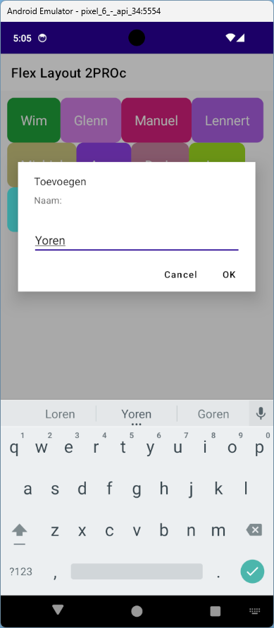
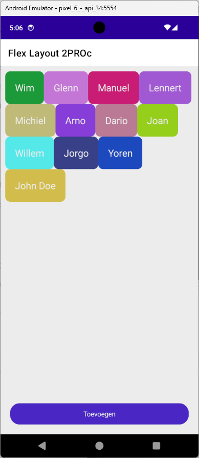
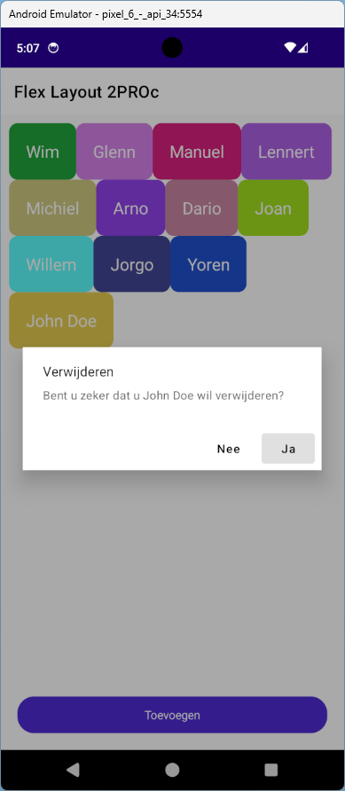

# Pop-ups

- Gebruik de [documentatie](https://docs.microsoft.com/en-us/dotnet/maui/user-interface/pop-ups) over pop-ups om deze oefening te maken
- Voeg een FlexLayout (**met de juiste eigenschappen**) toe aan de ScrollView van de MainPage
- Zorg voor een event handler voor het *click*-event van de *Toevoegen*-knop met de volgende functionaliteit:
	- Toon een prompt wanneer er op de knop geklikt wordt die de naam van een (junior-)collega vraagt
	- Wanneer een naam wordt ingevuld en er op *OK* wordt geklikt wordt deze toegevoegd aan de FlexLayout
		- Maak hiervoor telkens een Button aan (via C# code) en voeg deze toe als *child* van de FlexLayout
		- Gebruik voor elke Button de volgende eigenschappen:
			- Naam: resultaat van de prompt
			- FontSize: 20
            - Padding: 20
            - CornerRadius: 10
            - BackgroundColor = GetRandomColor()
		- Zorg er ook voor dat het *click*-event van elke knop wordt behandeld in een nieuwe event procedure
- Zorg ervoor dat een naam kan verwijderd worden uit de FlexLayout door er op te klikken, vraag eerst bevestiging!

  